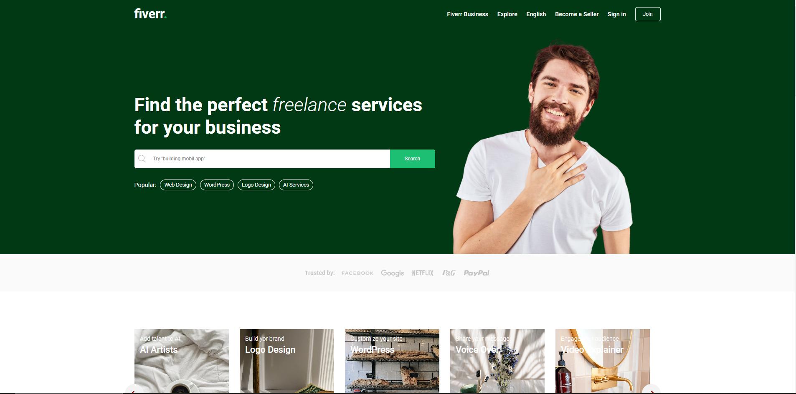
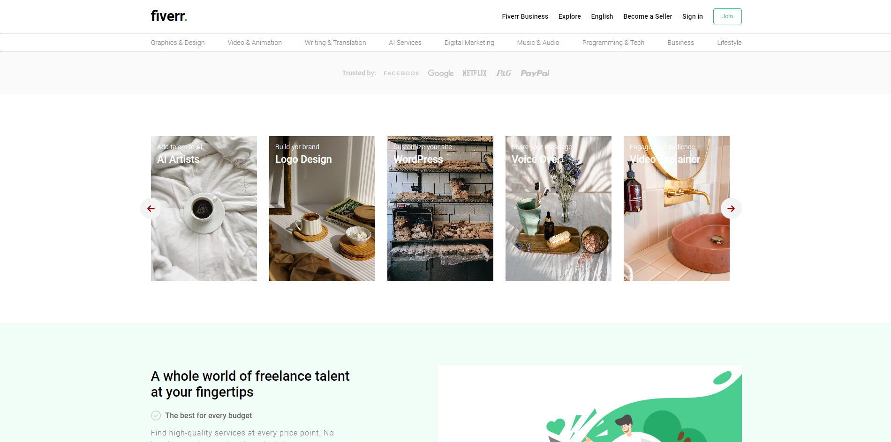

# Fiverr-clone--Full-Stack-Application

## Welcome! 👋

Thanks for checking out this Application.

## Overview
Fiverr is an online marketplace that connects freelancers with clients seeking a wide range of services, including graphic design, writing, programming, and digital marketing. It offers a platform for individuals and businesses to collaborate and outsource tasks, providing opportunities for both professionals and those looking to hire skilled talent.

## Screenshots

### Links

- App URL: [Github](https://github.com/shaheen7a/Fiverr-clone--Full-Stack-Application)

## My process

### Built with

- React Vite
- CSS (Sass)
- JSX
- Node
- Express
- MongoDB
- Slider
- JWT
- Bycrpt
- Cloudinary API

## Author

- Linkedin - [@aous-shaheen-381636221](https://www.linkedin.com/in/shaheen2001/)
- Facebook - [@aoushaheen7](https://www.facebook.com/shaheen72001/)

By me 🚀🚀🚀
